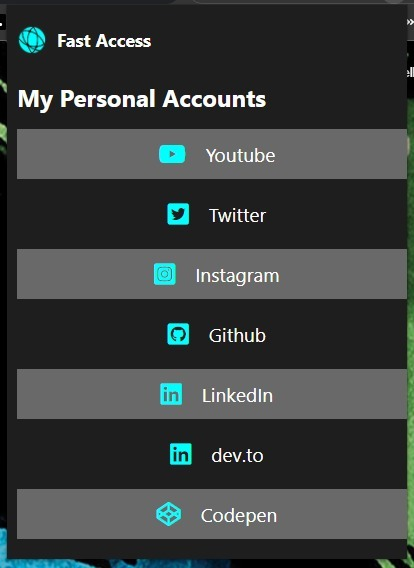

## Table of contents

- [Overview](#overview)
  - [Goal](#the-challenge)
  - [Screenshot](#screenshot)
  - [Links](#links)
  - [Built with](#built-with)
- [Author](#author)

## Overview

### Goal

Users should be able to:

- Customize the codes and add their links to the extension.

### Screenshot

### Built with

- HTML5
- CSS3
- Flexbox

## Author

- Muhammet Fatih Gül